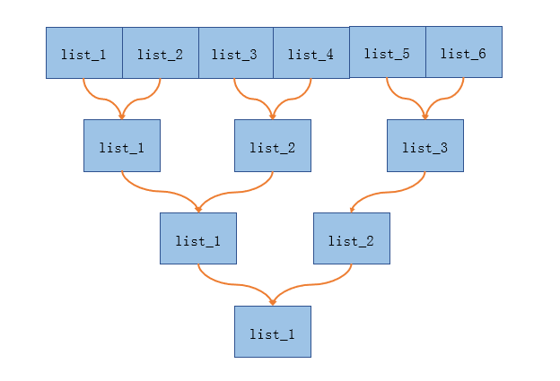

# 23. 合并K个升序链表

## 题目

给你一个链表数组，每个链表都已经按升序排列。

请你将所有链表合并到一个升序链表中，返回合并后的链表。

 

**示例 1：**
```
输入：lists = [[1,4,5],[1,3,4],[2,6]]
输出：[1,1,2,3,4,4,5,6]
解释：链表数组如下：
[
  1->4->5,
  1->3->4,
  2->6
]
将它们合并到一个有序链表中得到。
1->1->2->3->4->4->5->6
```
**示例 2：**
```
输入：lists = []
输出：[]
```
**示例 3：**
```
输入：lists = [[]]
输出：[]
```

**提示：**

- `k == lists.length`
- `0 <= k <= 10^4`
- `0 <= lists[i].length <= 500`
- `-10^4 <= lists[i][j] <= 10^4`
- `lists[i]` 按 **升序** 排列
- `lists[i].length` 的总和不超过 `10^4`

## 思路

在思考合并 **k** 个有序链表的时候，我们可以先将繁化简，先思考两个有序链表如何合并。LeetCode 上刚好也有一样的题目： [21. 合并两个有序链表](https://leetcode-cn.com/problems/merge-two-sorted-lists/)。

两个有序链表合并还是比较简单的，有两个要注意的地方：
1. 不要忘了定义一个哨兵结点来存储合并后的链表。
2. 不要忘了将两个比较完后有余的链表添加到结果链表的后面。

```
const merge = (list_1, list_2) => {
  const sentinelNode = new ListNode(0);
  let p = sentinelNode;

  while (list_1 && list_2) {
    if (list_1.val < list_2.val) {
      p.next = list_1;
      list_1 = list_1.next;
    } else {
      p.next = list_2;
      list_2 = list_2.next;
    }
    p = p.next;
  }

  p.next = list_1 ? list_1 : list_2;
  return sentinelNode.next;
};
```

接着就可以考虑如何分而治之了，如下图：


## 代码

```javascript []
/**
 * Definition for singly-linked list.
 * function ListNode(val) {
 *     this.val = val;
 *     this.next = null;
 * }
 */
/**
 * @param {ListNode[]} lists
 * @return {ListNode}
 */
var mergeKLists = function (lists) {
  /* 分而治之 */
  if (lists.length <= 1) return lists[0] || null;
  const newLists = [];
  for (let i = 0; i < lists.length; i += 2) {
    newLists.push(merge(lists[i], lists[i + 1] || null));
  }
  return mergeKLists(newLists);
};

const merge = (list_1, list_2) => {
  const sentinelNode = new ListNode(0);
  let p = sentinelNode;

  while (list_1 && list_2) {
    if (list_1.val < list_2.val) {
      p.next = list_1;
      list_1 = list_1.next;
    } else {
      p.next = list_2;
      list_2 = list_2.next;
    }
    p = p.next;
  }

  p.next = list_1 ? list_1 : list_2;
  return sentinelNode.next;
};
```

**最后有啥不足多多指教😜，Thanks♪(･ω･)ﾉ**