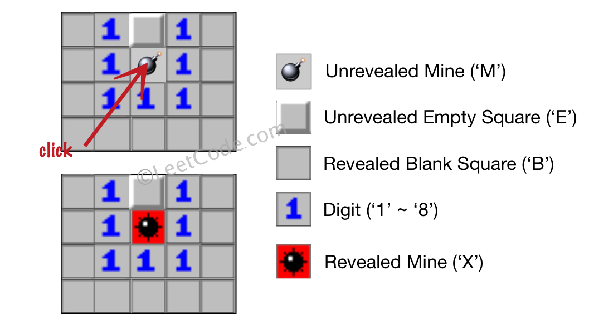

# 529. 扫雷游戏

## 题目

让我们一起来玩扫雷游戏！

给定一个代表游戏板的二维字符矩阵。 **'M'** 代表一个**未挖出的**地雷，**'E'** 代表一个**未挖出的**空方块，**'B'** 代表没有相邻（上，下，左，右，和所有4个对角线）地雷的**已挖出的**空白方块，**数字**（'1' 到 '8'）表示有多少地雷与这块**已挖出的**方块相邻，**'X'** 则表示一个**已挖出的**地雷。

现在给出在所有**未挖出的**方块中（'M'或者'E'）的下一个点击位置（行和列索引），根据以下规则，返回相应位置被点击后对应的面板：

1. 如果一个地雷（'M'）被挖出，游戏就结束了- 把它改为 **'X'**。
2. 如果一个没有相邻地雷的空方块（'E'）被挖出，修改它为（'B'），并且所有和其相邻的未挖出方块都应该被递归地揭露。
3. 如果一个至少与一个地雷相邻的空方块（'E'）被挖出，修改它为数字（'1'到'8'），表示相邻地雷的数量。
4. 如果在此次点击中，若无更多方块可被揭露，则返回面板。


**示例 1：**
```
输入: 

[['E', 'E', 'E', 'E', 'E'],
 ['E', 'E', 'M', 'E', 'E'],
 ['E', 'E', 'E', 'E', 'E'],
 ['E', 'E', 'E', 'E', 'E']]

Click : [3,0]

输出: 

[['B', '1', 'E', '1', 'B'],
 ['B', '1', 'M', '1', 'B'],
 ['B', '1', '1', '1', 'B'],
 ['B', 'B', 'B', 'B', 'B']]
```
**解释:**


**示例 2：**

```
输入: 

[['B', '1', 'E', '1', 'B'],
 ['B', '1', 'M', '1', 'B'],
 ['B', '1', '1', '1', 'B'],
 ['B', 'B', 'B', 'B', 'B']]

Click : [1,2]

输出: 

[['B', '1', 'E', '1', 'B'],
 ['B', '1', 'X', '1', 'B'],
 ['B', '1', '1', '1', 'B'],
 ['B', 'B', 'B', 'B', 'B']]

```

**解释:**



**注意：**

1. 输入矩阵的宽和高的范围为 [1,50]。
2. 点击的位置只能是未被挖出的方块 ('M' 或者 'E')，这也意味着面板至少包含一个可点击的方块。
3. 输入面板不会是游戏结束的状态（即有地雷已被挖出）。
4. 简单起见，未提及的规则在这个问题中可被忽略。例如，当游戏结束时你不需要挖出所有地雷，考虑所有你可能赢得游戏或标记方块的情况。

## 思路

扫雷一个我小时候经常玩的游戏了，规则也很清晰，所以我也立马看懂了题目需要干哈😁
不知道扫雷规则的可以去玩一玩。
**题目意思：** 大致是，比如你正在玩扫雷，输入你当前的扫雷地图和你当前点击的坐标，然后输出点击后扫雷地图的样子。
- 当你刚好点击的是雷时，则将点击的位置更改成'**X**'，并且游戏结束。
- 非雷时
    - 该位置已经点击过，啥事也没有。
    - 未被点击过
        - 周围8个格子没有雷时，则继续探索这8个格子（相当于依次点击了这8个格子）。
        - 有 **n** 个雷时（0 < n < 9），将点击的位置更改成 '**n**'，并且不会继续探索周围8个格子。

思路讲完了那开始上代码吧！！！

## 代码

### 深度优先遍历
``` javascript
/**
 * @param {character[][]} board
 * @param {number[]} click
 * @return {character[][]}
 */
var updateBoard = function (board, click) {
  const n = board.length, m = board[0].length;
  const direction = [[1, -1], [1, 0], [1, 1], [0, -1], [0, 1], [-1, -1], [-1, 0], [-1, 1]]; // 模拟方向

  const getMineNum = (i, j) => { // 获取周围雷的数量
    let mineNum = 0;
    for (const [x, y] of direction) {
      mineNum += isMine(i + x, j + y);
    }
    return mineNum + '';
  };

  const isMine = (i, j) => { // 是否为雷
    if (i < 0 || i >= n || j < 0 || j >= m || board[i][j] !== 'M') return 0;
    return 1;
  }

  /* dfs */
  const dfs = (i, j) => {
    if (i < 0 || i >= n || j < 0 || j >= m) return;
    if (board[i][j] !== 'E') {
      if (board[i][j] === 'M') {
        board[i][j] = 'X';
      }
      return;
    }
    board[i][j] = getMineNum(i, j);
    if (board[i][j] === '0') {
      board[i][j] = 'B';
      for (const [x, y] of direction) {
        dfs(i + x, j + y);
      }
    }
  };

  dfs(...click);
  return board;
};
```

### 广度优先遍历

``` javascript
/**
 * @param {character[][]} board
 * @param {number[]} click
 * @return {character[][]}
 */
var updateBoard = function (board, click) {
  const n = board.length, m = board[0].length;
  const direction = [[1, -1], [1, 0], [1, 1], [0, -1], [0, 1], [-1, -1], [-1, 0], [-1, 1]]; // 模拟方向

  const getMineNum = (i, j) => { // 获取周围雷的数量
    let mineNum = 0;
    for (const [x, y] of direction) {
      mineNum += isMine(i + x, j + y);
    }
    return mineNum + '';
  };

  const isMine = (i, j) => { // 是否为雷
    if (i < 0 || i >= n || j < 0 || j >= m || board[i][j] !== 'M') return 0;
    return 1;
  }

  /* bfs */
  const que = [click];

  while (que.length) {
    const [i, j] = que.shift();

    if (i < 0 || i >= n || j < 0 || j >= m) continue;
    if (board[i][j] !== 'E') {
      if (board[i][j] === 'M') { // 点击时就碰到了雷
        board[i][j] = 'X';
      }
      continue;
    }

    board[i][j] = getMineNum(i, j);
    if (board[i][j] === '0') {
      board[i][j] = 'B';
      for (const [x, y] of direction) {
        que.push([i + x, j + y]);
      }
    }
  }

  return board;
};
```