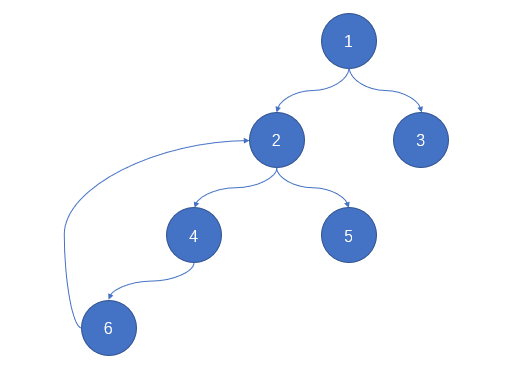
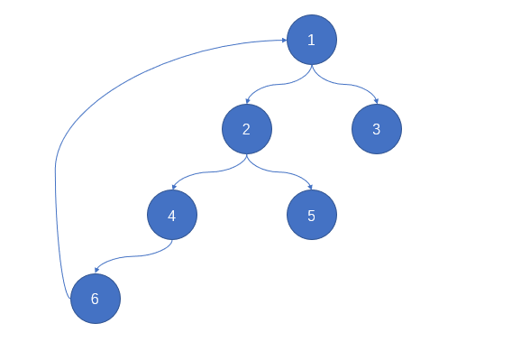

# 685. 冗余连接 II

## 题目

在本问题中，有根树指满足以下条件的**有向**图。该树只有一个根节点，所有其他节点都是该根节点的后继。每一个节点只有一个父节点，除了根节点没有父节点。

输入一个有向图，该图由一个有着N个节点 (节点值不重复1, 2, ..., N) 的树及一条附加的边构成。附加的边的两个顶点包含在1到N中间，这条附加的边不属于树中已存在的边。

结果图是一个以`边`组成的二维数组。 每一个`边` 的元素是一对 `[u, v]`，用以表示**有向**图中连接顶点 `u` 和顶点 `v` 的边，其中 `u` 是 `v` 的一个父节点。

返回一条能删除的边，使得剩下的图是有N个节点的有根树。若有多个答案，返回最后出现在给定二维数组的答案。

**示例 1:**
```
输入: [[1,2], [1,3], [2,3]]
输出: [2,3]
解释: 给定的有向图如下:
  1
 / \
v   v
2-->3
```
**示例 2:**
```
输入: [[1,2], [2,3], [3,4], [4,1], [1,5]]
输出: [4,1]
解释: 给定的有向图如下:
5 <- 1 -> 2
     ^    |
     |    v
     4 <- 3
```
**注意:**

- 二维数组大小的在3到1000范围内。
- 二维数组中的每个整数在1到N之间，其中 N 是二维数组的大小。

### 思路

本题给出的有向图的边和节点数均为 **N** 的，又因为 **有根树** 每一个节点只有一个父节点，除了根节点没有父节点。所以除了 **根节点** 的入度为 **0** 的每一个节点的 **入度** 都应该为 **1**。
继而可以得到两种情况：
    1. 有一个节点的 **入度** 为 2。
    2. 全部节点 **入度** 均为 1。

#### 第一种情况

这种情况仍然可以分成两种情况：
    1. 未成环：按道理返回任意一个均可，不过题目给出了要求就，按照题目的要求返回最后出现在给定二维数组的答案。
    2. 成环：此时就不可返回任意一个，一定要返回成环的那条边，如图：

此时节点 `2` 的入度为 **2**。如果返回的是 `[1, 2]`，则仍然不能达到题目的要求。返回的是 `[6, 2]` 便可。   
所以当第一种情况是，得判断是否成环。

#### 第二种情况

这种情况就比较简单了。此时有向图中一定是存在 **环** 的，并且返回 **环** 的任意一边均可。按照题目要求就返回最后出现在给定二维数组的答案。如图：

此时会发现不管返回 `[1, 2]`、`[2, 4]`、`[4, 6]` 还是 `[6, 1]` 均可达到题目要求。
所以，这种情况只需要找到有向图中的环就可了。

### 代码

``` javascript
/**
 * @param {number[][]} edges
 * @return {number[]}
 */
var findRedundantDirectedConnection = function (edges) {
  const len = edges.length, indegree = new Array(len + 1).fill(0); // 用数组来存储每个节点的入度情况

  const dfs = (j, n) => { // 判断是否成环，如果成环就返回节点的前继
    for (let x = 0; x < len; ++x) {
      if (edges[x][0] === j) {
        if (edges[x][1] === n) return j;
        return dfs(edges[x][1], n);
      }
    }
  };

  for (const edge of edges) {
    ++indegree[edge[1]];
    if (indegree[edge[1]] === 2) {
      let num = dfs(edge[1], edge[1]);
      if (typeof num === 'number') {
        return [num, edge[1]];
      }
      return edge; // 此时这条边一定是给定数组的后面的边，因为是从前面往后边遍历的
    }
  }

  for (let i = len - 1; i >= 0; --i) { // 从后面往前面遍历，保证是最后一条边
    if (typeof dfs(edges[i][1], edges[i][1]) === 'number') return edges[i];
  }
};
```

**最后，谢谢大家的浏览啦，有啥不足多多提出来😜，嘻嘻(#^.^#)**